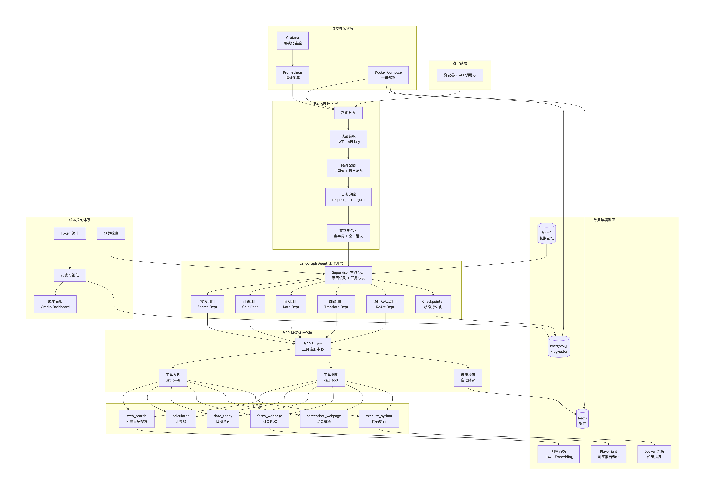
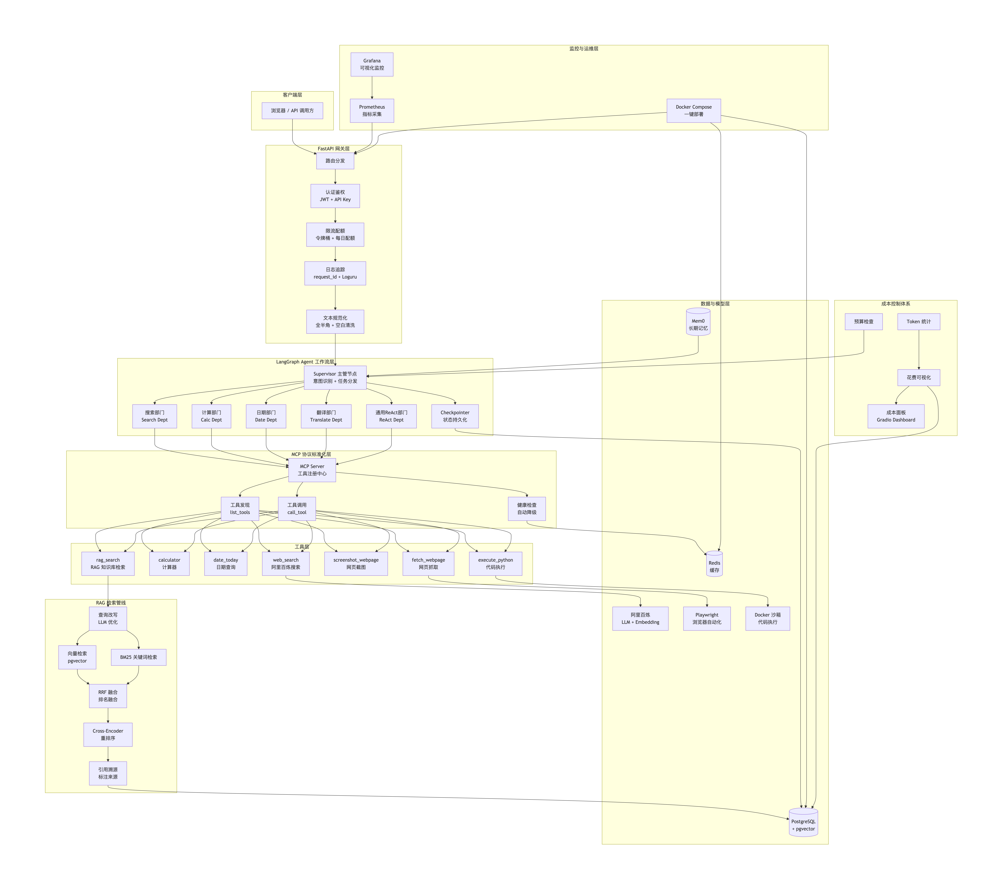

# 🤖 AI Agent 智能助理系统

一个生产级的 AI Agent 系统，具备多工具调用、任务规划、长期记忆、成本控制和工具可视化等核心能力，构建于 LangGraph、FastAPI、MCP 协议和 Mem0 之上。

## 🚀 核心亮点

| 亮点                 | 说明                                                       |
| :------------------- | :--------------------------------------------------------- |
| **多工具协同**       | 集成搜索、计算器、网页抓取、浏览器截图、代码执行等 6+ 工具 |
| **MCP 标准化**       | 所有工具通过 MCP 协议标准化封装，新增工具只需一行配置      |
| **Plan-and-Execute** | 复杂任务自动分解为有序步骤，按步骤执行并处理异常           |
| **长期记忆**         | 基于 Mem0 的跨会话记忆，记住用户偏好和关键信息             |
| **成本控制**         | Token 统计、花费可视化、预算检查、多级拦截                 |
| **工具可视化**       | 每次工具调用的参数、结果、耗时完整记录，支持时间线展示     |
| **预算管理**         | 单次调用上限、单线程上限、每日预算上限三级控制             |
| **工具降级** | 关键工具失效时自动切换到备选方案，保证服务不中断 |
| **工具调用可视化** | 完整记录每次工具调用的参数、结果、耗时，支持时间线可视化 |

## 🏗 系统架构



┌──────────────────────────────────────────────────────────┐
│ 用户/前端 (Web / API) │
└──────────────────────────┬───────────────────────────────┘
│
┌──────────────────────────▼───────────────────────────────┐
│ FastAPI 网关层 │
│ ┌─────────┐ ┌─────────┐ ┌─────────┐ ┌─────────┐ │
│ │ 认证鉴权 │ │ 限流配额 │ │ 日志追踪 │ │ 文本规范化│ │
│ └─────────┘ └─────────┘ └─────────┘ └─────────┘ │
└──────────────────────────┬───────────────────────────────┘
│
┌──────────────────────────▼───────────────────────────────┐
│ LangGraph Agent 工作流 │
│ ┌──────────────────────────────────────────────────┐ │
│ │ Supervisor (意图识别 + 任务分发) │ │
│ └────┬───────┬───────┬───────┬───────┬────────────┘ │
│ │ │ │ │ │ │
│ ┌────▼──┐┌──▼───┐┌──▼───┐┌──▼───┐┌──▼──────┐ │
│ │ 搜索 ││ 计算 ││ 日期 ││ 翻译 ││ 通用ReAct│ │
│ │ 部门 ││ 部门 ││ 部门 ││ 部门 ││ 部门 │ │
│ └───────┘└──────┘└──────┘└──────┘└──────────┘ │
└──────────────────────────┬───────────────────────────────┘
│
┌──────────────────────────▼───────────────────────────────┐
│ MCP 协议标准化层 │
│ ┌──────────────────────────────────────────────────┐ │
│ │ MCP Server (工具注册 + 健康检查) │ │
│ └──────────────────────────────────────────────────┘ │
└──────────────────────────┬───────────────────────────────┘
│
┌──────────────────────────▼───────────────────────────────┐
│ 数据与模型层 │
│ ┌──────────┐ ┌──────────┐ ┌──────────┐ ┌──────────┐ │
│ │PostgreSQL│ │ Redis │ │Mem0 记忆 │ │Docker沙箱│ │
│ │(pgvector)│ │ (缓存) │ │ (长期) │ │ (代码执行)│ │
│ └──────────┘ └──────────┘ └──────────┘ └──────────┘ │
│ ┌──────────────────────────────────────────────────┐ │
│ │ 阿里百炼 API (LLM + Embedding + 搜索) │ │
│ └──────────────────────────────────────────────────┘ │
└──────────────────────────────────────────────────────────┘

text

## 🏗 系统架构（完整版：Agent + RAG）



## 💰 成本控制体系

本系统建立了一套完整的成本控制体系，从事前预估到事后分析全覆盖：

| 环节         | 功能                          | 说明                                         |
| :----------- | :---------------------------- | :------------------------------------------- |
| **事前预估** | 工具调用成本预估              | 每个工具都有预估成本，调用前判断是否超出预算 |
| **事中拦截** | 多级预算检查                  | 单次调用上限 → 单线程上限 → 每日预算上限     |
| **事后统计** | Token 花费追踪                | 每次 LLM 调用自动记录 Token 消耗和费用       |
| **数据分析** | 月度花费报告                  | 按用途、按模型的费用分布和趋势分析           |
| **可视化**   | Gradio 成本面板               | 饼图、折线图直观展示花费情况                 |
| **优化策略** | 缓存 + 模型降级 + Prompt 压缩 | 将日均花费降低约 30%                         |

## 🔍 工具调用可视化

每次 Agent 执行任务时，系统会自动记录完整的执行轨迹——包括每次工具调用的名称、参数、返回结果、执行耗时和成功状态。这些轨迹数据随 API 返回结果一起提供，也可通过独立的时间线页面直观查看。

**访问地址：** `http://localhost:8000/static/trace_viewer.html`

**时间线展示效果：**
- 🧠 Agent 决策节点（蓝色）——展示 Agent 决定调用哪个工具
- 🔧 工具调用节点（绿色=成功，红色=失败）——展示参数、结果、耗时
- 📝 最终输出——展示 Agent 基于所有工具结果生成的最终答案

## 🛠 技术栈

| 类别             | 技术                         | 用途                          |
| :--------------- | :--------------------------- | :---------------------------- |
| **Agent 框架**   | LangGraph + Checkpointer     | 多节点工作流、状态持久化      |
| **Web 框架**     | FastAPI                      | API 服务和网关                |
| **协议标准**     | MCP (Model Context Protocol) | 工具标准化封装                |
| **长期记忆**     | Mem0                         | 跨会话用户偏好记忆            |
| **数据库**       | PostgreSQL + pgvector        | 文档向量存储 + 成本记录       |
| **缓存**         | Redis                        | Embedding 缓存 + 工具调用缓存 |
| **浏览器自动化** | Playwright                   | 网页抓取和截图                |
| **代码执行**     | Docker 沙箱                  | 安全执行 Agent 生成的代码     |
| **监控**         | Prometheus + Grafana         | 指标采集和可视化              |
| **容器化**       | Docker + Docker Compose      | 一键部署                      |
| **测试**         | pytest + Locust              | 单元测试 + 性能压测           |
| **评估**         | RAGAS                        | 检索质量自动评估              |

## 📊 项目指标

| 指标 | 数值 | 说明 |
| :--- | :--- | :--- |
| **API 接口总数** | 30+ | 覆盖认证、检索、文档管理、Agent 对话、记忆管理、成本统计、健康检查等 |
| **Agent 工具数量** | 6+ | web_search、calculator、date_today、fetch_webpage、screenshot_webpage、execute_python |
| **MCP 标准化工具** | 6 | 所有工具均通过 MCP 协议标准化封装，支持动态发现和调用 |
| **核心模块数量** | 15+ | 包含 Agent 工作流、检索管线、记忆管理、成本控制、工具可视化等 |
| **代码行数** | 5000+ | Python 代码总量 |
| **单元测试覆盖** | 63%+ | 覆盖认证、检索、文档管理、Agent 对话等核心接口 |
| **数据库表** | 5 | documents、api_keys、token_usage_logs、cost_records、cost_records_archive |
| **Redis 缓存项** | 4 类 | Embedding 缓存、工具调用缓存、查询改写缓存、健康检查状态 |
| **Docker 服务** | 5 | API、PostgreSQL、Redis、Prometheus、Grafana、（Mem0数据库Qdrand，目前用Python库，后续升级使用Docker服务） |
| **GitHub Actions CI** | 1 | 自动运行 pytest 测试 |

## 📖 API 文档

    完整的 API 文档请查看：
    -   **在线文档**：启动服务后访问 `http://localhost:8000/docs`（Swagger UI）
    -   **离线文档**：[Agent API 接口说明](docs/api_agent.md)

## 🚀 快速开始

### 1. 克隆项目
```bash
git clone https://jihulab.com/你的用户名/agent-assistant.git
cd agent-assistant
2. 配置环境变量

bash
cp .env.example .env
# 编辑 .env，填入你的阿里百炼 API Key 等信息
3. 一键启动

bash
docker compose up -d
4. 验证

bash
curl http://localhost:8000/health
# 应返回 {"status":"healthy",...}

curl http://localhost:8000/api/v1/
# 应返回 {"status":"ok","version":"v1"}
5. 访问服务

| 服务             | 地址                                           | 说明                       |
| :--------------- | :--------------------------------------------- | :------------------------- |
| **API 文档**     | http://localhost:8000/docs                     | Swagger UI 交互式文档      |
| **成本面板**     | http://localhost:8000/dashboard                | Gradio 成本可视化          |
| **轨迹查看器**   | http://localhost:8000/static/trace_viewer.html | 工具调用时间线             |
| **Grafana 监控** | http://localhost:3000                          | 系统性能监控 (admin/admin) |
| **Prometheus**   | http://localhost:9090                          | 指标采集                   |
🎬 演示 Demo

我们准备了 3 个演示场景来展示 Agent 的综合能力：

Demo	场景	展示能力
研究型任务	研究量子计算最新进展，生成报告	Plan-and-Execute、搜索、网页抓取、代码执行
数据处理	分析销售数据，计算统计指标	代码生成、安全沙箱、错误修复
多轮记忆	记住偏好并基于偏好回答	Mem0 长期记忆、个性化回答
详细演示步骤和录屏请查看 docs/demos.md。

📁 项目结构

text
api/
├── agent_graph_advanced.py   # LangGraph Agent 工作流
├── agent_graph.py             # 基础 ReAct Agent
├── agent_checkpointer.py     # Checkpointer 持久化 Agent
├── plan_execute.py           # Plan-and-Execute 模块
├── mcp_server.py             # MCP Server（工具注册中心）
├── mcp_tool_factory.py       # MCP 工具工厂
├── memory_store.py           # Mem0 长期记忆模块
├── token_tracker.py          # Token 统计与预算控制
├── cost_dashboard.py         # Gradio 成本面板
├── tool_visualizer.py        # 工具调用可视化
├── tool_health.py            # 工具健康检查与降级
├── simple_tools.py           # 简单工具集（计算器、日期）
├── search_tools.py           # 搜索工具
├── browser_tools.py          # 浏览器自动化工具
├── code_executor.py          # 代码执行器（安全沙箱）
├── query_rewriter.py         # 查询改写模块
├── rag_pipeline.py           # RAG 检索管线
├── main.py                   # FastAPI 应用入口
└── ...                       # 更多模块
📄 许可证

MIT License

text

#### 三、将 README 放入项目

1.  将上面的内容保存为 `README.md`，放在项目二根目录。
2.  如果有独立的 Agent 项目仓库，将其作为仓库的主 README。
3.  提交并推送：
    ```bash
    git add README.md
    git commit -m "docs: 完善项目二README，包含架构图、技术栈和成本控制亮点"
    git push