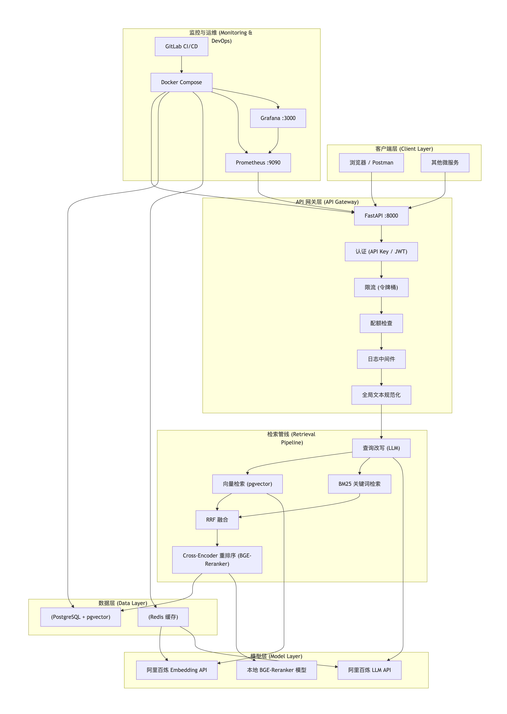

# RAG Agent API

一个生产级的RAG（检索增强生成）API服务，集成了混合检索、重排序、查询改写和引用溯源等核心能力，构建于FastAPI、PostgreSQL(pgvector)和Redis之上。

## 🚀 性能指标

| 指标 | 数值 |
| :--- | :--- |
| **P99 检索延迟** | `< 800ms` |
| **基础检索失败率** | `< 0.1%` |
| **Embedding 缓存命中率** | `> 90%` |
| **多格式文档支持** | PDF, Word, Markdown, HTML |

## 🏗 技术架构



 Mermaid 源码:```mermaid
graph TB
    subgraph "客户端层 (Client Layer)"
        A[浏览器 / Postman]
        B[其他微服务]
    end

    subgraph "API 网关层 (API Gateway)"
        C[FastAPI :8000]
        C1[认证 (API Key / JWT)]
        C2[限流 (令牌桶)]
        C3[配额检查]
        C4[日志中间件]
        C5[全局文本规范化]
    end

    subgraph "检索管线 (Retrieval Pipeline)"
        D1[查询改写 (LLM)]
        D2[向量检索 (pgvector)]
        D3[BM25 关键词检索]
        D4[RRF 融合]
        D5[Cross-Encoder 重排序 (BGE-Reranker)]
    end

    subgraph "数据层 (Data Layer)"
        E1[(PostgreSQL + pgvector)]
        E2[(Redis 缓存)]
    end

    subgraph "模型层 (Model Layer)"
        F1[阿里百炼 Embedding API]
        F2[阿里百炼 LLM API]
        F3[本地 BGE-Reranker 模型]
    end

    subgraph "监控与运维 (Monitoring & DevOps)"
        G1[Prometheus :9090]
        G2[Grafana :3000]
        G3[Docker Compose]
        G4[GitLab CI/CD]
    end

    A --> C
    B --> C
    C --> C1 --> C2 --> C3 --> C4 --> C5
    C5 --> D1
    D1 --> D2
    D1 --> D3
    D2 --> D4
    D3 --> D4
    D4 --> D5
    D5 --> E1
    D2 --> F1
    D5 --> F3
    D1 --> F2
    E2 --> F1
    E2 --> F2
    G1 --> C
    G2 --> G1
    G3 --> C
    G3 --> E1
    G3 --> E2
    G3 --> G1
    G3 --> G2
    G4 --> G3
Mermaid 源码:```


┌─────────────┐ ┌──────────────┐ ┌─────────────────┐
│ 用户/前端 │────▶│ FastAPI │────▶│ PostgreSQL │
│ │ │ :8000 │ │ (pgvector) :5432 │
└─────────────┘ └──────┬───────┘ └─────────────────┘
│
┌─────────┼─────────┐
▼ ▼ ▼
┌──────────┐ ┌────────┐ ┌──────────────┐
│ Redis │ │ BGE- │ │ 阿里百炼 API │
│ :6379 │ │Reranker│ │ Embedding/LLM │
└──────────┘ └────────┘ └──────────────┘

text

## ❓ 常见问题

    遇到问题请先查阅 [FAQ 与故障排查](docs/FAQ.md)。


## 🛠 技术栈

| 类别 | 技术 | 说明 |
| :--- | :--- | :--- |
| **Web框架** | FastAPI | 高性能异步API框架 |
| **数据库** | PostgreSQL + pgvector | 关系型数据库 + 向量检索 |
| **缓存** | Redis | Embedding缓存、工具调用缓存、限流计数器 |
| **重排序** | BGE-Reranker | Cross-Encoder模型，提升检索精度 |
| **监控** | Prometheus + Grafana | 指标采集与可视化大屏 |
| **容器化** | Docker + Docker Compose | 一键部署 |
| **测试** | pytest + Locust | 单元测试、集成测试、性能压测 |
| **评估** | RAGAS | 自动化检索质量评估 |
| **CI/CD** | GitHub Actions | 自动测试工作流 |

## ✨ 核心功能

-   **多模态检索**：支持 `fast`（快速）、`accurate`（精确）和 `full`（完整）三种模式，可灵活组合向量检索、BM25关键词检索、RRF融合和Cross-Encoder重排序。
-   **查询改写**：利用LLM对用户问题进行上下文补全和指代消解，显著提升多轮对话场景下的检索准确率。
-   **引用溯源**：答案自动标注信息来源，支持点击溯源到原始文档块。
-   **流式输出**：基于SSE实现逐字生成，支持“暂停/继续”并实现真中断，避免Token浪费。
-   **认证与权限**：支持API Key和JWT双认证，三级权限控制（管理员/付费用户/免费用户）。
-   **限流与配额**：令牌桶限流 + 每日配额控制。
-   **多格式文档**：支持PDF、Word、Markdown、HTML，含复杂PDF表格和双栏解析。

## 📈 评估体系

-   **自动评估**：集成RAGAS，自动评估忠实度、答案相关性、上下文召回率和精确率。
-   **人工评估**：从完整性、简洁性、逻辑性、可用性四个维度进行定性分析。
-   **Bad Case分析**：持续跟踪并分析失败案例，驱动系统优化。

## 🚀 快速开始

### 1. 克隆项目
```bash
git clone https://github.com/你的用户名/rag-agent-api.git
cd rag-agent-api
2. 配置环境变量

bash
cp .env.example .env
# 编辑 .env，填入你的阿里百炼 API Key 等信息
3. 一键启动

bash
docker compose up -d
4. 验证

bash
curl http://localhost:8000/health
# 应返回 {"status":"healthy",...}

curl http://localhost:8000/api/v1/
# 应返回 {"status":"ok","version":"v1"}
5. 访问文档

Swagger UI: http://localhost:8000/docs
Grafana 监控: http://localhost:3000 (admin/admin)
Prometheus: http://localhost:9090
📁 项目结构

text
.
├── api/                    # 应用代码
│   ├── main.py             # FastAPI 应用入口
│   ├── api_v1.py           # V1 版本路由
│   ├── rag_pipeline.py     # 综合检索管线
│   ├── reranker.py         # Cross-Encoder 重排序
│   ├── query_rewriter.py   # 查询改写
│   ├── hybrid_search.py    # 混合检索
│   ├── db.py               # 数据库操作
│   ├── cache.py            # Redis 缓存
│   ├── config.py           # 环境变量集中管理
│   ├── exceptions.py       # 错误码与异常定义
│   ├── schemas.py          # Pydantic 模型
│   ├── deps.py             # 依赖注入
│   ├── chunker.py          # 文档分块
│   ├── document_parser.py  # 多格式文档解析
│   ├── document_preprocessor.py # 文档预处理管道
│   ├── rate_limiter.py     # 令牌桶限流
│   ├── quota_limiter.py    # 配额管理
│   ├── metrics.py          # Prometheus 指标
│   ├── auth.py             # 认证逻辑
│   └── ...                 # 更多模块
├── docker-compose.yml      # 服务编排
├── prometheus.yml          # Prometheus 配置
├── locustfile_v2.py        # 性能压测脚本
└── README.md               # 本文件

📄 许可证

MIT License

一键部署文件：deploy.md
