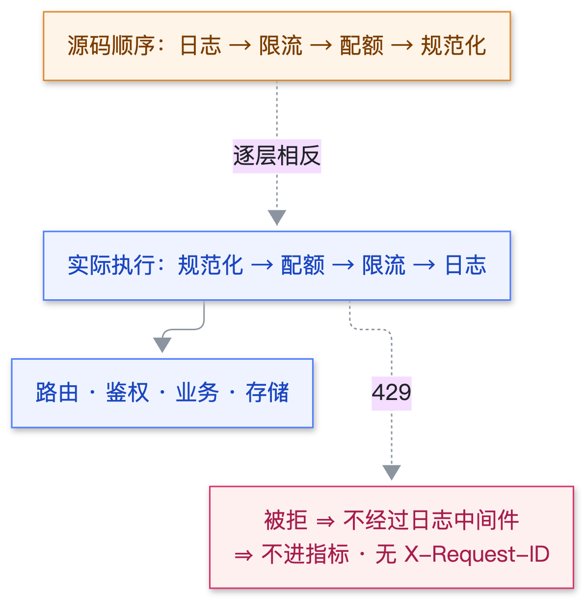
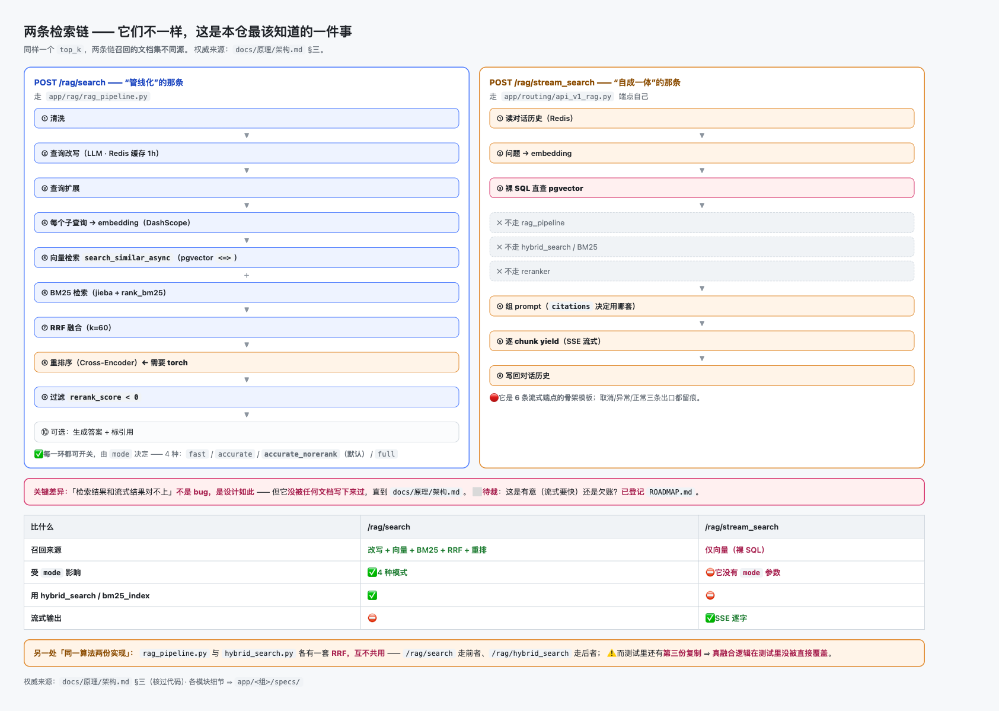
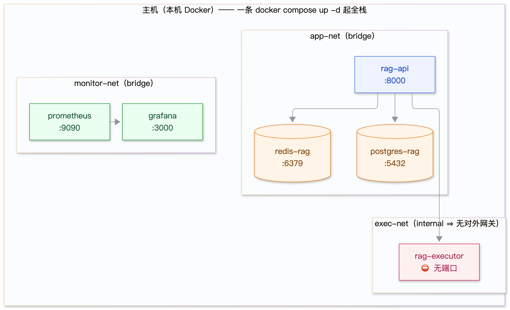

# RAG Agent API

一个 **RAG（检索增强生成）+ Agent API 服务** —— 混合检索、重排序、查询改写、引用溯源、
LangGraph Agent、MCP 工具、Mem0 长期记忆、Token 成本控制。
构建于 **FastAPI + PostgreSQL(pgvector) + Redis** 之上。

> ⚠️ **不称"生产级"** —— 本仓的性能数字**全部未实测**（见「性能目标」），且有 5 条已知限制
> （见「已知限制」）。把一个没有验收数据的东西称作"生产级"是**没有依据的断言**。

> 📌 **本仓是「轻量版」**：受硬件条件约束（本机 **8 GB 内存 / 4 核**）**经过三轮删减**后留下的**可运行最小集**。
> 它**不是**这个项目的全貌 —— **完整版还包含相当一部分本仓没有的模块与能力**，那些**不在本仓范围内**。
> **本段只承诺一件事：本仓里的这部分能跑、可验**（下面「快速开始」照做即可，`pytest` 也有可对照的基线）。

---

## 快速开始

### 前置要求

| 需要 | 说明 |
|---|---|
| **Docker + Docker Compose v2** | **唯一必需** —— 一条 `docker compose up -d` 起全栈（PostgreSQL+pgvector / Redis / API / Prometheus / Grafana） |
| **磁盘 / 内存** | ⚠️ 要**下载并构建 GB 级镜像**（`app/requirements.txt` 含 torch 系）⇒ **首次启动较慢**。**8 GB 内存的机器上实测构建会失败** —— 那是环境天花板，不是配置写错（见「已知限制」） |
| **Python 3.10** | ⚠️ **只有要跑测试 / 本地改代码时才需要**（`app/Dockerfile` 基础镜像也是 3.10）。**⛔ 别用 `python3`** —— 本机实测它 = 3.14.7，只有 `python3.10` 可用 |

### 1 · 克隆

```bash
git clone https://github.com/heweidong-ecco/fastapi-rag-agent.git
cd fastapi-rag-agent
```

### 2 · 配置环境变量

```bash
cp .env.example .env
```

`app/core/config.py` 的 `validate_config` 检查**四项，缺任何一项都拒绝启动**：

| 键 | 说明 |
|---|---|
| `DASHSCOPE_API_KEY` | Embedding 用（阿里云百炼） |
| `POSTGRES_PASSWORD` | ⚠️ **容易漏** —— `.env.example` 给的是占位值 `mysecretpassword`，本地 Docker 用它也能起，但**不能删 / 留空** |
| `JWT_SECRET_KEY` | 随便一串随机值 |
| `LOGIN_PASSWORD` | 管理员登录口令 |

> 生成随机值：`python3 -c "import secrets; print(secrets.token_urlsafe(24))"`

**生成 / 对话 LLM 默认走 DashScope 的 `qwen-turbo` / `qwen-plus`**。想换成 DeepSeek 等 OpenAI 兼容端点，
取消 `.env.example` 第 4–9 行的注释并填 `LLM_*` 四键（详见「模型端点」）。

### 3 · 启动（**一条命令**）

```bash
docker compose up -d
```

⚠️ **首次会构建 API 镜像**（`app/requirements.txt` 含 torch 系）⇒ 要下几个 GB、构建较久。
**8 GB 内存的机器上实测会失败** —— 环境天花板，不是配置写错。

#### 如果机器上**已经有** `postgres-rag` / `redis-rag` 容器

```bash
docker ps --format '{{.Names}}' | grep -E 'postgres-rag|redis-rag'
```

**先看清它们是不是本仓的** —— `docker compose up` 按 **compose 项目**工作，而那些容器可能属于别的项目
（`docker compose ps` 会是空的，即"不认领"）。此时 `up` 会**建新网络**并计划重建同名容器
⇒ 要么撞名硬失败，要么把已有容器重建掉。**先确认再动手。**

### 4 · 验证

```bash
curl http://localhost:8000/health
# {"status":"healthy","checks":{"database":"ok","redis":"ok","embedding_api":"deferred to external monitoring"}}

curl http://localhost:8000/ready
# {"status":"ready"}   ← ⚠️ 启动后 10 秒内会返回 503，那是设计行为，不是坏了
```

再取个 token、跑一次真实检索（**这才是"真的跑起来了"**）：

```bash
# ⚠️ 先把 .env 的值载进当前 shell —— 否之会发空口令 ⇒ 401
set -a; . ./.env; set +a

TOK=$(curl -s -X POST localhost:8000/api/v1/auth/login -H 'Content-Type: application/json' \
  -d "{\"user_name\":\"$LOGIN_USER_NAME\",\"password\":\"$LOGIN_PASSWORD\"}" \
  | python3 -c 'import sys,json;print(json.load(sys.stdin)["access_token"])')

curl -s -X POST localhost:8000/api/v1/rag/hybrid_search -H "Authorization: Bearer $TOK" \
  -H 'Content-Type: application/json' -d '{"question":"测试","top_k":3}'
# ⇒ {"method":"hybrid (vector + bm25)","docs":[...]}   docs 的 "from" 字段是 vector/bm25/both
```

> ⚠️ **此时知识库是空的**（新装的库没有文档）⇒ `docs` 会是 `[]`，**正常**。
> 要看非空结果 ⇒ 按 `docs/demos.md` 灌几篇文档，或参考 `/api/v1/rag/insert`。

### 5 · 打开这些界面

| 界面 | 地址 |
|---|---|
| API 文档（Swagger UI） | http://localhost:8000/docs |
| 成本看板（Gradio） | http://localhost:8000/dashboard |
| Grafana | http://localhost:3000（`admin` / `admin`） |
| Prometheus | http://localhost:9090 |

### 本地开发 / 跑测试（**开发路径，不是交付路径**）

```bash
python3.10 -m venv venv
venv/bin/pip install -r app/requirements.txt
bash dev.sh        # 起 postgres+redis → 等就绪 → 起 uvicorn（热重载）
```

> 📌 **依赖清单只有一份：`app/requirements.txt`**（刻意不留"轻量版"第二份，避免两处漂移）。
> 代价是本机会拉 torch 系；但 `app/rag/reranker.py` 是**真懒加载**，
> **不碰 torch 也能跑**（默认模式 `accurate_norerank`）。

---

## 核心功能

- **多模态检索** —— **4 种模式**：`fast` / `accurate` / **`accurate_norerank`（默认）** / `full`，
  可组合**向量检索 + BM25 + RRF 融合 + Cross-Encoder 重排序**。
  ⚠️ 默认档**不依赖 torch**，是演示镜像里唯一能用的精确档。
- **查询改写** —— LLM 做上下文补全与指代消解，提升多轮场景的检索准确率。
- **引用溯源** —— 答案后端自动标注来源（`[来源:n]` 行内标记 + 结构化 `sources`）。
  ⚠️ **`citations` 默认 `False`** —— 不显式打开，连后端都不会给引用。
- **流式输出（SSE）** —— **6 条流式端点**（RAG 端 1 条 + 5 条对话链各 1 条），走共享层 `app/routing/sse.py`。
- **认证与权限** —— API Key + JWT 双认证，三级角色（管理员 / 付费 / 免费）。
- **限流与配额** —— 令牌桶限流 + **四层 token 限额**（单次 / 会话 / 用户日级 / 全站日级）+ 按 key 熔断。
- **多格式文档** —— PDF / Word / Markdown / HTML，含复杂 PDF 表格与双栏解析。
- **Agent 能力** —— LangGraph 多分支路由、MCP 工具协议、Plan-and-Execute、Mem0 长期记忆、Token 成本控制。

## 模型端点（⚠️ **两件事别混**）

- **Embedding 固定走** 阿里云百炼 DashScope `text-embedding-v2`（1536 维）。
- **生成 / 对话 LLM 是可配置的**，而 **`app/core/config.py` 的默认值是 DashScope + `qwen-turbo`/`qwen-plus`**。
  ⚠️ **新克隆下来跑的是 qwen，不是 DeepSeek** —— 后者只是 **`.env`（不入库）里的取值**，⛔ 不是代码默认值。
  要切：填 `LLM_BASE_URL` / `LLM_API_KEY` / `LLM_MODEL_FAST` / `LLM_MODEL_CHAT` **四个**环境变量
  （`LLM_API_KEY` 不填则回退用 `DASHSCOPE_API_KEY`）。`.env.example` 第 4–9 行已备好注释模板。

## 技术栈

| 层 | 用什么 |
|---|---|
| Web 框架 | **FastAPI** + Uvicorn |
| 存储 | **PostgreSQL + pgvector**（业务表 + 向量）· **Redis**（缓存 / 限流桶 / 会话） |
| Agent 编排 | **LangGraph**（`agent_graph` / `agent_graph_advanced*` / `agent_checkpointer`）· **LangChain**（模型与工具抽象） |
| LLM 客户端 | **`langchain-openai`** 的 `ChatOpenAI`（全仓经 `app/core/llm_factory.make_llm()` **唯一构造**）<br>**裸 `openai` SDK** —— 🔴 **2 处不走 LangChain**：`app/rag/embedding_client.py`（embedding）与 `app/rag/query_rewriter.py`（改写）；它们拿到的是**裸响应**（只有 `.usage`，没有 `usage_metadata`） |
| Embedding | 阿里云百炼 DashScope `text-embedding-v2`（**固定**） |
| 重排序 | 本地 `BAAI/bge-reranker-v2-m3`（**真懒加载**，镜像里没装 torch ⇒ 只在开发机跑） |
| 工具协议 / 记忆 | **MCP**（`app/tools/mcp_server.py`）· **mem0**（本地 Qdrant） |
| 看板 / 评估 | **Gradio**（成本看板）· **RAGAS**（离线评估，⬜ 未实跑） |
| 可观测 | `prometheus_client` + Prometheus + Grafana |

🔴 **一处要说清**：`app/agent/plan_execute.py` 是**本仓【手写】的规划-执行循环**，⛔ **不是框架** ——
它零命中 `langgraph` / `StateGraph`，只 import `langchain_core.messages`（判据：`grep -c yield app/agent/plan_execute.py` ⇒ **0**）。
⇒ 它是 4 套 Agent 实现里**唯一不建图**的那一套。

📄 逐项 + 落点 ⇒ `docs/原理/架构.md` §1 · 环境变量 ⇒ `docs/契约/环境变量.md`

## 系统架构

### ① 系统总览 —— 四层


| 层 | 里面是什么 |
|---|---|
| **中间件 ×4** | 文本规范化 · 配额 · 限流 · 日志/指标（**执行顺序见 ②**） |
| **路由层 ×3** | `api_v1`（公开/认证/调试）· `api_v1_rag`（文档/检索/SSE/WS）· `api_v1_agent`（Agent/预算/轨迹） |
| **能力层** | 检索管线 9 模块 · **Agent 6 套并存**（⚠️ 哪套是产品版本 —— 未裁） · 四层限额与熔断 · 成本记账 |
| **存储** | PostgreSQL + pgvector（**7 张表**）· Redis（embedding/改写缓存 · 限流桶 · 会话） |
| **外部服务** | **DashScope**（embedding 固定走它）· **`rag-executor`**（独立容器 · **无网**）· Prometheus + Grafana |

### ② 一次请求怎么走 —— ⚠️ 中间件顺序陷阱



> 🔴 `add_middleware` 内部是 `user_middleware.insert(0, …)`，而洋葱用 `reversed()` 包
> ⇒ **最后 add 的在最外层、最先执行** ⇒ **实际执行顺序与源码顺序逐层相反**。
>
> 🔴 **两个可观察后果**：
> 1. **被 429 拒掉的请求不进日志中间件** ⇒ **不进 Prometheus 指标** · **没有 `X-Request-ID`**。
>    📌 查「为什么某次 429 在指标里看不到」—— 先看这条。
> 2. **配额那层排在最外层第 2 位，且要查 PG** ⇒ **每个请求**（含最终被拒的）都先付一次 `SELECT SUM(…)`。

### ③ 两条检索链 —— 召回来源**不同源**



> 🔴 `/rag/search` 走**完整管线**（改写 + 向量 + BM25 + RRF + 重排）；
> `/rag/stream_search` **只做向量（裸 SQL 直查）**，**没有 `mode` 参数**、**不走 BM25 / 不走重排**。
> ⇒ **「检索结果和流式结果对不上」不是 bug，是设计如此。**

### ④ 部署拓扑 —— 6 容器 · 3 张网络



> 🔴 **所有对外端口只绑 `127.0.0.1`**（`8000` 原先是 `0.0.0.0` = 同网段任何人可调）。
> 🔴 `exec-net` 是 **`internal: true`** ⇒ **执行器出不了互联网**；应用侧**不碰 `docker.sock`**。
> ⚠️ **两处未解决**：Grafana 仍是默认口令 · 看板是**手工配置**的（仓库无 provisioning）。

> 📄 **图源是 Mermaid**（`docs/原理/图源/*.mmd`）⇒ 改它 + 跑 **`bash docs/原理/图源/出图.sh`** 重出。
> 📄 **文字版（更全，且核过代码）⇒ `docs/原理/架构.md`**。

## 性能目标（⚠️ **是目标值 —— 不是指标**）

> 🔴 **本表此前写作「性能指标」** —— 已改。仓库里**有**一次旧压测记录（2026-06-25），
> **但它不能支撑这几个数，方向甚至相反**：那次跑在**坏掉的环境**上（同日日志含 113 条未捕获异常：
> redis 解析失败 / postgres 域名解析失败），**与 77–97% 的错误率自洽** ⇒ **P99 那几个数不能采信**。

| 目标 | 目标值 | 现状 |
|---|---|---|
| P99 检索延迟 | `< 800ms` | ⬜ **无可采信数据** |
| 基础检索失败率 | `< 0.1%` | ⬜ **从未达标过**（旧记录 77–97%，但那环境本身是坏的） |
| Embedding 缓存命中率 | `> 90%` | ⬜ 未实测 |
| 多格式文档支持 | PDF / Word / Markdown / HTML | ✅ 已实现（`app/rag/document_parser.py`） |

## 评估体系

| 项 | 状态 |
|---|---|
| **RAGAS 脚本 + 数据集** | ✅ **已入库**（`app/eval/evaluate_with_ragas.py` · `eval_dataset.json` 37 条 + 2 份历史报告） |
| **是否实跑过** | ⬜ **没有** —— 本机 venv 未装 `ragas`/`datasets`，且脚本需 API 在跑 ⇒ **"已入库" ≠ "跑通了"** |
| 历史评估数字（2026-06-29 · **由原系统**跑出） | `faithfulness` 0.6267 · `context_recall` 0.7568 · `context_precision` 0.4369 |

📄 跑法与前置 ⇒ `docs/说明/测试.md`

## 已知限制（诚实清单）

> 本仓立过一条规矩：**「后果性断言必须有一条当场可跑的命令支撑」**。下面几条**已知不达标**，免得被当成"已实现"。

| # | 限制 | 影响 |
|---|---|---|
| 1 | **浏览器工具已挂起** —— 从工具表里摘掉了（`mcp_server.TOOLS` 两行注释掉，**工具数 6 → 4**）<br>原因：`app/Dockerfile` 与 `docker-compose.yml` **都没有 `playwright install`** ⇒ **换机器 / 用 Docker 一样跑不了**（不是"本机毛病"）；另本机缓存是 chromium 1228 而 playwright 1.62 要 1234。<br>🔧 要重新启用：装好 chromium 后按 `app/tools/mcp_server.py` 那段注释列的 **4 处一起**取消注释（⚠️ 代价 **+556 MB**） | 少 2 个工具 + 2 个 REST 端点 |
| 2 | **`mode=accurate/full` 与重排序未验** —— 装不下 torch + `bge-reranker-v2-m3`（2.3 GB） | 默认档 `accurate_norerank` 可用，但这两条路径**本机验不了** |
| 3 | **性能数字全部未实测** | 见「性能目标」—— 不得作为选型 / 承诺依据 |
| 4 | **知识库语料良莠不齐** —— `documents` 表 **35/77 行是测试数据** | 同一问题可能命中切题的、也可能命中测试垃圾。**演示前建议先灌一份干净语料** |
| 5 | **本地 Qdrant 是单实例锁** —— `mem0_client` 在 `memory_store.py` **模块导入期**就开 `./.mem0/qdrant` | 应用跑着时 `pytest` 跑不了。逃生口：从**仓库根**跑 + 设 `MEM0_DIR=<临时目录>`（**两个都要**） |

## 文档导航

> 🔴 **要找文档 ⇒ 从仓库根 `CLAUDE.md` 进**（它有一张「本仓目录索引」）。
> 每层目录都有自己的 `CLAUDE.md`，那是**那一层的索引表**。

| 要找… | 去哪 |
|---|---|
| **这份代码怎么组织的**（模块全景 / 请求流 / 依赖枢纽） | `docs/原理/架构.md` |
| **接口清单** | 跑 `bash scripts/list_endpoints.sh`（**⛔ 不写进文档** —— 手写的必然过期） |
| **表结构** | `docs/契约/数据模型.md` + `app/schema.sql` |
| **常见问题 / 故障排查** | `docs/FAQ.md` |
| **让另一个 Agent 来测这个项目** | `docs/给Agent的测试与调试指南.md`（含可直接粘贴的 Prompt） |
| **文档该放哪 / 还没有哪些文档** | `docs/文档地图.md`（⚠️ 2026-10-09 起**已瘦成指针页**，只剩判据与欠账清单） |
| **一键部署** | `docs/说明/部署.md` |
| **Demo 做到哪一步** | `demo/demo清单.md`（施工区在 `demo/设置与命令/`，⚠️ 已 gitignore ⇒ clone 看不到） |

## 项目状态与路线

**当前阶段**：**后端已完成**，正在做**前端初稿**；终点是**一个能分享的 Demo**（魔搭社区 · 创空间）。

| 想知道 | 去哪 |
|---|---|
| **做到哪了 · 下一步 · 执行顺序** | ⭐ **`ROADMAP.md`** 的「🧭 一屏总览」（**首屏**） |
| **还没做完的** | ⭐ **`docs/待办总表.md`**（唯一权威） |
| **改动史** | `CHANGELOG.md` |
| **做过的选择**（备选 / 反悔成本） | `docs/decisions/` |

## 贡献

本仓是**个人项目**，没有开放协作流程，但**欢迎报 bug / 提建议**。
要改代码或提 PR 前，先读 **[`CONTRIBUTING.md`](CONTRIBUTING.md)** —— 里面有：怎么跑起来 ·
常用命令 · **提交前要过的门** · 目录约定。

## 安全

- **报告漏洞** ⇒ **[`SECURITY.md`](SECURITY.md)**（**请走私密渠道**，⛔ 不要开公开 issue）
- 同一份里也写了**安全现状**：已收窄的端口 · 依赖漏洞清零 · CodeQL / gitleaks ·
  `docs/威胁模型.md`（资产 / 信任边界 / **已接受的残余风险**）

## 许可证

**MIT License** —— 全文见 [`LICENSE`](LICENSE)。
