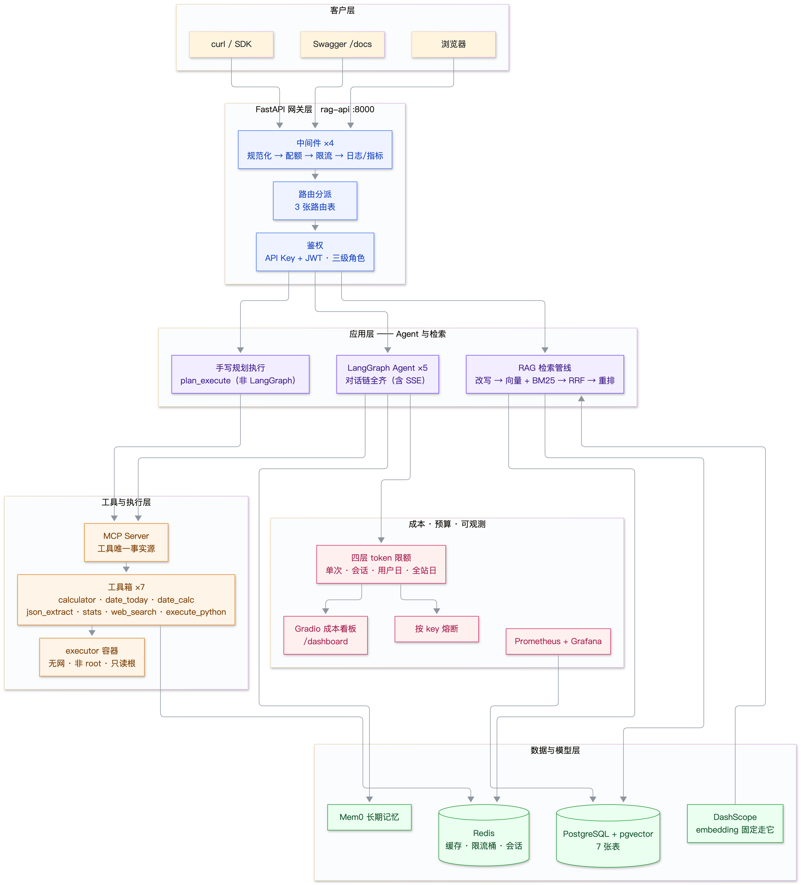
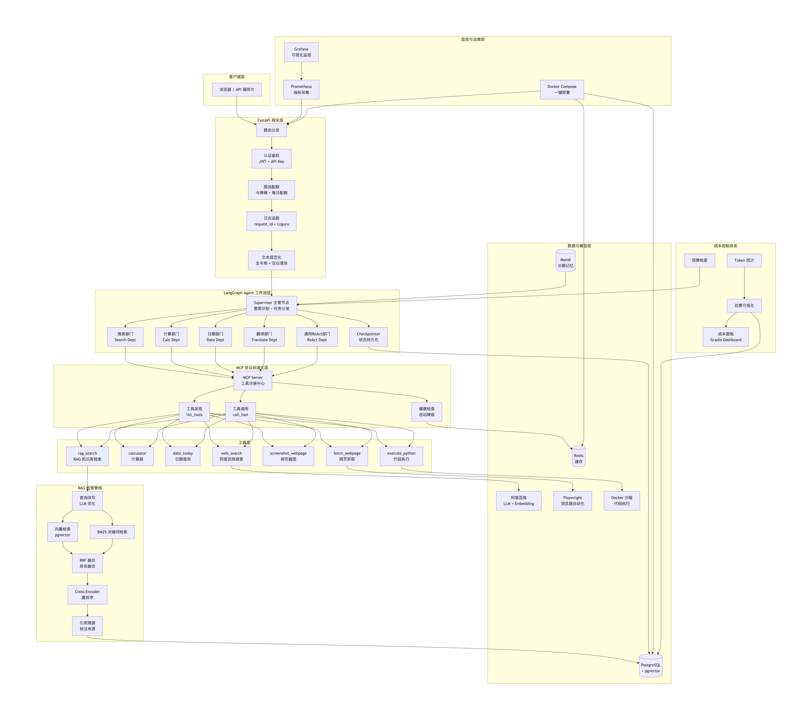

# RAG Agent API

> ## 📍 找文档？先看 [`docs/文档地图.md`](docs/文档地图.md)
>
> 那是**全项目文档的索引** —— 一页列出「**我想知道 X ⇒ 去哪**」+ 全部文档清单 + **还没建的**。
> 🔴 **现状/进度/待办** ⇒ 一律以 [`ROADMAP.md`](ROADMAP.md) 为准（**唯一权威**）。
> 🔴 **接口清单** ⇒ 跑 `bash scripts/list_endpoints.sh`（**不写进文档**，会过期）。

> ## 📌 先读这一段：**本仓是「轻量版」**
>
> 本仓是**受硬件条件约束**（本机 8GB 内存 / 4 核）**经过三轮删减**后留下的**可运行最小集**。
> 它**不是**这个项目的全貌 —— **完整版还包含相当一部分本仓里没有的模块与能力**，
> 那些部分**不在本仓的范围内**，也不由本仓的测试覆盖。
>
> **本仓里保留的这部分**，代码有单元测试与模块级测试覆盖，**是可以跑、可以验的** ——
> 下面「快速开始」照做即可，`pytest` 也有可对照的基线数字。
>
> ⚠️ **两点如实说明（别让这段话被误读）**：
> 1. **被删掉的那部分，本仓无法为它背书** —— 它们的可运行性、测试情况都在本仓之外，
>    本仓既看不到、也验不了。**本段只承诺"本仓里的东西能跑"。**
> 2. **删减的直接代价已经登记在文档里**，不是"删掉了但功能照旧"：
>    `mode=accurate/full` 与重排序在本机跑不了（装不下 torch + 2.3GB 模型）；
>    具体清单见下方「📊 性能目标」与「⚠️ 已知限制」。

一个 RAG（检索增强生成）+ Agent API 服务，集成了混合检索、重排序、查询改写、引用溯源、LangGraph Agent、MCP 工具、Mem0 长期记忆和成本控制等核心能力，构建于 FastAPI、PostgreSQL(pgvector)、Redis 之上。

> 🔴 2026-09-20 改：原文首句写「一个**生产级的** RAG + Agent API 服务」——
> **已删去"生产级"**。理由：本仓的性能数字**全部未实测**（见下），
> 且有三条已知限制；把一个没有验收数据的东西称作"生产级"是**没有依据的断言**。

**模型端点**（⚠️ **两件事别混**）：
- **Embedding 固定走** 阿里云百炼 DashScope `text-embedding-v2`（1536 维）。
- **生成/对话 LLM 是可配置的**，而 **`api/config.py` 的默认值是 DashScope + `qwen-turbo`/`qwen-plus`**。
  🔴 **本项目开发机上用的是 DeepSeek**（`.env` 里 `LLM_BASE_URL=https://api.deepseek.com` ·
  `LLM_MODEL_FAST`/`LLM_MODEL_CHAT=deepseek-v4-flash`），但那是 **`.env`（不入库）里的取值**，
  **不是代码默认值** —— **新克隆下来跑的是 qwen，不是 DeepSeek。**
  要切，填 `LLM_BASE_URL` / `LLM_API_KEY` / `LLM_MODEL_FAST` / `LLM_MODEL_CHAT` **四个**环境变量
  （`LLM_API_KEY` 不填则回退用 `DASHSCOPE_API_KEY`）——
  **`.env.example` 第 4–9 行已备好这四个键的注释模板**（默认注释掉 ⇒ 不填就是 DashScope）。

## 📊 性能目标（⚠️ **目标值 —— 不是指标**）

> 🔴 **这三行此前写作「性能指标」，且下面这张表是核对时改的。**
>
> **仓库里【有】一次旧压测记录**（见 `性能基线报告模板.txt`，2026-06-25，三档并发 10/20/35）——
> ⚠️ **但那份记录不能用来支撑这三个数，方向甚至相反**：

| 旧记录（2026-06-25） | 值 | 与下表目标对比 |
| :--- | :--- | :--- |
| P99 延迟 | **68 / 32 / 28 ms**（10/20/35 并发） | **低于**目标的 800ms ✅ |
| **错误率** | **77.24% / 96% / 97%** | 🔴 **远糟于**目标的 `< 0.1%` |
| QPS | 5.1 / 10.5 / 17.8 req/s | — |

> ⚠️ **那次压测跑在坏掉的环境上**：同日 `api/logs/api_2026-06-25.log` 含 **113 条未捕获异常**
> （`redis:6379` 解析失败、`could not translate host name "postgres"`），**与 77–97% 的错误率自洽**。
> ⇒ **P99 那几个数不能采信**（失败请求不产生正常延迟样本），**口径也从未复核过**。
>
> 📌 **所以本表的每一格「现状」都是 ⬜**：不是"没有记录"，而是 **"那份记录不可用"**。
> `ROADMAP.md` 里那句「P99 / 失败率 / 并发 / Grafana **尚无实测数据**」指的正是这个意思
> （核查清单 24 项**全部未勾**）。

| 目标 | 目标值 | 现状 |
| :--- | :--- | :--- |
| **P99 检索延迟** | `< 800ms` | ⬜ **无可采信数据**（旧记录 28–68ms **跑在坏环境上**，不可用） |
| **基础检索失败率** | `< 0.1%` | 🔴 **旧记录 77–97%（环境坏，不可用；但说明这条从未达标过）** |
| **Embedding 缓存命中率** | `> 90%` | ⬜ **未实测** |
| **多格式文档支持** | PDF, Word, Markdown, HTML | ✅ 已实现（`api/document_parser.py`） |

## 🏗 技术架构



**整套系统架构图**（上面那张没画到的部分：MCP 工具层 · 部门制 Agent · 成本控制体系）：



> 📌 **2026-09-20**：这张图原在 `Agent/docs/architecture_full.png`，随 `Agent/` 目录处置搬到 `docs/`。
> 它是**整套系统**级别的图（另一张 `docs/architecture.png` 只到子系统级）。
>
> ✅ **已逐项核对，图上组件本仓都有**：
> FastAPI 网关（路由/认证/限流/日志/文本规范化）· LangGraph **部门制 Agent**
> （Supervisor + 检索/计算/日期/翻译/ReAct + Checkpointer —— `api/agent_graph_advanced_learning.py:105/134/154/169/197/246`）
> · **MCP Server 工具注册中心**（`api/mcp_server.py:24`）· RAG 检索管线 · Mem0 / Redis / pgvector
> · **成本控制体系**（`api/cost_dashboard.py`）· Grafana + Prometheus（`docker-compose.yml:90`）。
>
> ⚠️ **一处已过时，别照图核代码**：图上工具层画的是 **`rag_search`**，而当前的实际工具是
> **`fetch_webpage_html`**（`api/agent_graph_advanced_learning.py:47-51`）。⇒ 这张图记录的是**更早一代**的工具集。

## ❓ 常见问题

遇到问题请先查阅 [FAQ 与故障排查](docs/FAQ.md)。

## 🛠 技术栈

| 类别 | 技术 | 说明 |
| :--- | :--- | :--- |
| **Web框架** | FastAPI | 高性能异步API框架 |
| **数据库** | PostgreSQL + pgvector | 关系型数据库 + 向量检索 |
| **缓存** | Redis | Embedding缓存、工具调用缓存、限流计数器 |
| **重排序** | BGE-Reranker | Cross-Encoder模型，提升检索精度 |
| **监控** | Prometheus + Grafana | 指标采集与可视化大屏 |
| **容器化** | Docker + Docker Compose | 一键部署 |
| **测试** | pytest + Locust | 单元测试、集成测试、性能压测 |
| **评估** | RAGAS ✅ **脚本已入库** · ⬜ **未实跑** | 脚本与数据集已在 `api/`；`ragas`/`datasets` 在 `requirements.txt` 里，但**本机 venv 未安装** ⇒ **未跑过验证** —— 见「📈 评估体系」 |
| **CI/CD** | GitHub Actions | 自动测试工作流 |

## ✨ 核心功能

-   **多模态检索**：**4 种模式** —— `fast` / `accurate` / **`accurate_norerank`（默认）** / `full`，
    可灵活组合向量检索、BM25 关键词检索、RRF 融合和 Cross-Encoder 重排序。
    > 🔴 **2026-09-29 更正**：原文写「**三种模式**（fast / accurate / full）」——
    > **漏了 `accurate_norerank`，而它恰恰是默认值**（且**不依赖 torch**，是镜像里唯一能用的精确档）。
    > 另外原文**把 `fast` 说成"只查向量"也不对** —— 它**含 BM25 + RRF**。
    > 判据：`api/api_v1_rag.py:467-476` 的枚举 · 详见 `docs/契约/接口契约.md` §四。
-   **查询改写**：利用LLM对用户问题进行上下文补全和指代消解，显著提升多轮对话场景下的检索准确率。
-   **引用溯源**：答案**后端**会自动标注信息来源（`[来源:n]` 行内标记 + 结构化 `sources`）。
    > 🔴 **2026-09-29 更正**：原文写「**支持点击溯源到原始文档块**」—— **"点击"不成立**。
    > **全仓没有业务前端**（`api/static/` 只有 3 个调试测试页，**无 `package.json`**）⇒
    > **能点的界面还没做**（属**硬门 B 的前端部分**，排在「后端先行」之后）。
    > ⚠️ 另：**`citations` 默认 `False`** —— 不显式打开，**连后端都不会给引用**。
    > 详见 `docs/契约/接口契约.md` §四 · `ROADMAP.md` 功能现状表。
-   **流式输出**：基于 SSE 逐字生成（`POST /rag/stream_search`，**全仓唯一 SSE 端点**）。
    > 🔴 **2026-09-29 更正**：原文写「**支持真中断，避免 Token 浪费**」—— **不成立**。
    > 实测：全仓**唯一**的中断处理是 `api/api_v1_rag.py:676` 的 `except asyncio.CancelledError`
    > ⇒ 只有 `print` + `yield [DONE]`；**全仓无 `is_disconnected` / `aclose`** ⇒ **不关上游 HTTP 流**；
    > **且全仓无前端、无停止按钮**。
    > ⇒ 属**硬门 C**，见 `后端补齐清单` **B2**（它自标「**最容易假完成**」）。
-   **认证与权限**：支持API Key和JWT双认证，三级权限控制（管理员/付费用户/免费用户）。
-   **限流与配额**：令牌桶限流 + 每日配额控制。
-   **多格式文档**：支持PDF、Word、Markdown、HTML，含复杂PDF表格和双栏解析。
-   **Agent 能力**：LangGraph 多分支路由、MCP 工具协议、Plan-and-Execute、Mem0 长期记忆、Token 成本控制。

## 📈 评估体系

> 🔴 **2026-09-20 更正记录（保留）**：本段原写「**集成 RAGAS**，自动评估忠实度、答案相关性、上下文召回率和精确率」——
> **当时不成立**：`ragas` 在 `requirements.txt` 里，但 `api/` 下 0 处 `import` 它，
> 而唯一用它的脚本被 `.gitignore` 排除在库外（审计称「**RAGAS 三重缺席**」）。

> 🟢 **2026-09-20 补（本次）**：**该链路已移入库内** —— 脚本 + 数据集 + 两份历史报告，见下。
> ⚠️ **但本次没有实跑过它**（原因写在下面那条），**"已入库" ≠ "跑通了"**。

-   ✅ **自动评估（RAGAS）· 脚本与数据集已入库**
    - `api/evaluate_with_ragas.py` —— 独立脚本，**不被应用 import**，需手动跑
    - `api/eval_dataset.json` —— 37 条评测集；`api/ragas_report.json` / `ragas_detailed_report.json` —— 历史报告
    - 跑法：`cd api && python evaluate_with_ragas.py`（前置：`pip install ragas datasets`，且 API 在 `localhost:8000` 跑着）
    - ⚠️ 登录口令**改从环境变量读**（`LOGIN_USER_NAME` / `LOGIN_PASSWORD`，不设可用默认值），脚本不再内置口令
-   ⬜ **未实跑验证** —— 本机 venv **未安装** `ragas`/`datasets`（虽在 `requirements.txt` 里），
    且脚本需 API 在跑 ⇒ **它在本次交付的验收范围内没有被执行过**。要跑通需先补装依赖。
-   📊 **历史评估证据**（**2026-06-29 由原系统跑出，不是本次复现**）：`eval_size` 37 ·
    `faithfulness` **0.6267** · `context_recall` **0.7568** · `context_precision` **0.4369** ·
    `answer_relevancy` **NaN**（该项当时未算出）
-   **人工评估**：从完整性、简洁性、逻辑性、可用性四个维度进行定性分析。
-   **Bad Case分析**：持续跟踪并分析失败案例，驱动系统优化。

## 🚀 快速开始

**前置要求**（⚠️ 2026-09-20 补 —— 原先没写，而 Python 版本是**硬要求**）：

| 需要 | 说明 |
|---|---|
| **Docker + Docker Compose v2** | **唯一必需** —— 一条 `docker compose up -d` 起全栈（PostgreSQL+pgvector / Redis / API / Prometheus / Grafana） |
| **磁盘 / 内存** | ⚠️ 要**下载并构建 GB 级镜像**（`api/requirements.txt` 含 torch 系）⇒ **首次启动较慢**。**8GB 内存的机器上实测构建会失败** —— 那是环境天花板，不是配置写错（见「已知限制」） |
| **Python 3.10** | ⚠️ **只有要跑测试 / 本地改代码时才需要**（`api/Dockerfile` 的基础镜像也是 3.10）。**不要用 `python3`** —— 本机实测 `python3` = **3.14.7**，只有 `python3.10`（3.10.10）可用 |

### 1. 克隆项目

```bash
git clone https://github.com/heweidong-ecco/fastapi-rag-agent.git
cd fastapi-rag-agent
```

> 🔴 2026-09-20 修：此处原为 `git clone https://github.com/你的用户名/rag-agent-api.git`
> —— **是占位符，照抄必然 `Repository not found`**（已实测）。现改为真实地址。

### 2. 配置环境变量

```bash
cp .env.example .env
# `api/config.py` 的 validate_config 检查【四项】—— 缺任何一项都【拒绝启动】：
#   DASHSCOPE_API_KEY   —— Embedding 用（阿里百炼）
#   POSTGRES_PASSWORD   —— ⚠️ 这一项容易漏！.env.example 里给了个占位值 mysecretpassword，
#                          不改成真的也能起来（本地 Docker 就是那套），但**不能删/留空**
#   JWT_SECRET_KEY      —— 随便一串随机值
#   LOGIN_PASSWORD      —— 管理员登录口令
# 生成随机值：python3 -c "import secrets; print(secrets.token_urlsafe(24))"
#
# 生成/对话 LLM 默认走 DashScope 的 qwen-turbo / qwen-plus；
# 想换成 DeepSeek 等 OpenAI 兼容端点，取消 .env.example 第 4–9 行的注释并填 LLM_* 四键。
```

> 🔴 2026-09-20 修：此处原写「**三项**」——**漏了 `POSTGRES_PASSWORD`**。
> 实测 `api/config.py:58-74` 检查的是 **4 项**；漏写会让"删了这一项 ⇒ 起不来 ⇒ 按本表查不到原因"。

### 3. 启动（**一条命令**）

```bash
cp .env.example .env      # 上一步填好【四项】必填
docker compose up -d
```

⚠️ **首次会 `build` API 镜像**（`docker-compose.yml:13` 的 `build: context: ./api`），
而 `api/requirements.txt` 含 torch 系 ⇒ **要下几个 GB、构建较久**。
**8GB 内存 / Docker 配额较小的机器上实测会失败** —— 那是**环境天花板，不是配置写错了**（见下方「已知限制」）。

> 🔴 **2026-09-20 方向更正**：本段此前写的是「**两条路径**」（轻量：DB 用 Docker + API 跑本机；Docker 全量），
> **推荐轻量那条，还立了「别用 `docker compose up`」的红线**。**现已收敛成上面这一条** ——
> 业务方口径：「**不用双 requirements.txt，这样会混，最后肯定是用 docker-compose 一键编排的，
> 别人 git clone 也是 docker-compose**」、「**整个项目阶段性完成，本来就是要完整明了、简洁的交付**」。
> ⇒ **删掉分叉**，也**删掉那条红线的理由**（它原本是为"别打断 `agent-eval-gate` 评测"立的，而该顾虑已作废）。

#### ⚠️ 如果你的机器上**已经有** `postgres-rag` / `redis-rag` 容器

```bash
docker ps --format '{{.Names}}' | grep -E 'postgres-rag|redis-rag'
```

**有的话先看清它们是不是本仓的** —— `docker compose up` 是**按 compose 项目**工作的，而容器可能不属于本项目。

> ⚠️ **这个坑是实测的（2026-09-20）**：本机 `postgres-rag` / `redis-rag` 的
> `com.docker.compose.project` 是 **`my-fixed-name`**、`config_files` 指向**另一个仓库**的 compose 文件；
> 本仓 `docker compose ps` **是空的**（不认领它们）。此时 `up` 会计划 **`Container postgres-rag Creating`**
> + 建新网络 ⇒ **要么撞名硬失败，要么把已有容器重建到 `fastapi-rag-agent_app-net`**。
>
> ⛔ **原文此处写的是"重建会打断 `agent-eval-gate` 的评测，所以这是红线"—— 该理由已作废**
> （业务方：「**不用考虑 agent-eval-gate 占用 docker-compose，那个项目已经做完了，我们正常使用**」）。
> ✅ **但"重建已有容器会断掉指向它的东西"这个现象本身仍然成立** ⇒ 所以是**先确认再动手**，不是无条件禁止。

#### 🔧 本地开发 / 跑测试（**这是开发路径，不是交付路径**）

交付只需要上面那一条命令。**只有当你要在本机跑 `pytest` 或改代码时**，才需要这一套：

```bash
python3.10 -m venv venv
venv/bin/pip install -r api/requirements.txt
cd api && ENABLE_DASHBOARD=false ../venv/bin/uvicorn main:app --host 127.0.0.1 --port 8000
```

> ⚠️ **必须在 `api/` 目录下起 uvicorn**（有一处路径按相对位置解析）。`bash dev.sh` 干的就是这一步。
>
> 📌 **依赖清单只有一份：`api/requirements.txt`。** 🔴 2026-09-20 删掉了此前那份"轻量版"
> `api/requirements-test.txt` —— 业务方口径「**不用双 requirements.txt，这样会混**」。
> 已核安全性：实测那份是 `requirements.txt` 的**真子集**（含版本约束在内比对整行 ⇒ 只在它里面出现的行 = **空**），
> 切过去**不丢任何包**。代价是本机会拉 torch 系；但 `api/reranker.py:14` 是真懒加载，
> **不碰 torch 也能跑**（默认模式 `accurate_norerank`）。

### 4. 验证（**以下输出是 2026-09-20 实测的原文**）

```bash
curl http://localhost:8000/health
# {"status":"healthy","checks":{"database":"ok","redis":"ok","embedding_api":"deferred to external monitoring"}}

curl http://localhost:8000/api/v1/
# {"status":"ok","version":"v1"}

curl http://localhost:8000/ready
# {"status":"ready"}      ← ⚠️ 启动后 10 秒内会返回 503，那是设计行为，不是坏了
```

再取个 token、跑一次真实检索（**这才是"真的跑起来了"**）：

```bash
# ⚠️ 先把 .env 里的值载进当前 shell —— 下面两行【原本没写，照抄会拿到空口令 ⇒ 401】
set -a; . ./.env; set +a          # 或者手写：export LOGIN_USER_NAME=admin LOGIN_PASSWORD='你的口令'

TOK=$(curl -s -X POST localhost:8000/api/v1/auth/login -H 'Content-Type: application/json' \
  -d "{\"user_name\":\"$LOGIN_USER_NAME\",\"password\":\"$LOGIN_PASSWORD\"}" \
  | python3 -c 'import sys,json;print(json.load(sys.stdin)["access_token"])')

curl -s -X POST localhost:8000/api/v1/rag/hybrid_search -H "Authorization: Bearer $TOK" \
  -H 'Content-Type: application/json' -d '{"question":"测试","top_k":3}'
# 应返回 {"method":"hybrid (vector + bm25)","docs":[...]} —— docs 里的 "from" 字段是 "vector"/"bm25"/"both"
```

> 🔴 2026-09-20 修：`$LOGIN_USER_NAME` / `$LOGIN_PASSWORD` **只存在于 `.env`，它们不是 shell 变量**
> —— 原版没写怎么把它们导出来，照抄会发出**空用户名/空口令**（`TOK` 取不到，下一句 401）。
> **这正是本 PR 要消灭的那类"照抄跑不通"。** 已补 `set -a; . ./.env; set +a`。

> ⚠️ **此时知识库是空的**（新装的库没有文档）⇒ `docs` 会是 `[]`，**这是正常的**。
> 要看非空结果，先按 `docs/demos.md` 灌几篇文档，或参考 `/api/v1/rag/insert`。

### 5. 访问文档

`docker compose up -d` 起的是**全栈**，所以下面这些都会有：

-   Swagger UI：http://localhost:8000/docs
-   成本看板（Gradio）：http://localhost:8000/dashboard
-   Grafana 监控：http://localhost:3000 (admin/admin)
-   Prometheus：http://localhost:9090

## 🤖 用另一个 Agent 来测这个项目？

见 **`docs/给Agent的测试与调试指南.md`** —— 里面有可直接粘贴的 Prompt、分层命令行、每个失败的已知原因。

## 📁 项目结构

```
.
├── api/                    # 应用代码
│   ├── main.py             # FastAPI 应用入口
│   ├── api_v1.py           # V1 版本路由
│   ├── rag_pipeline.py     # 综合检索管线
│   ├── reranker.py         # Cross-Encoder 重排序
│   ├── query_rewriter.py   # 查询改写
│   ├── hybrid_search.py    # 混合检索
│   ├── db.py               # 数据库操作
│   ├── cache.py            # Redis 缓存
│   ├── config.py           # 环境变量集中管理
│   ├── exceptions.py       # 错误码与异常定义
│   ├── schemas.py          # Pydantic 模型
│   ├── deps.py             # 依赖注入
│   ├── chunker.py          # 文档分块
│   ├── document_parser.py  # 多格式文档解析
│   ├── document_preprocessor.py # 文档预处理管道
│   ├── rate_limiter.py     # 令牌桶限流
│   ├── quota_limiter.py    # 配额管理
│   ├── metrics.py          # Prometheus 指标
│   ├── auth.py             # 认证逻辑
│   └── ...                 # 更多模块
├── docs/                   # 项目文档（FAQ、架构图、Demo、决策记录）
├── archive/                # 归档的未使用文件（⚠️ **被 .gitignore 排除，不在库里**）
├── docker-compose.yml      # 服务编排
├── prometheus.yml          # Prometheus 配置
├── locustfile_v2.py        # 性能压测脚本
└── README.md               # 本文件
```

> 📌 **关于原 `Agent/` 目录（2026-09-20 已处置）**
>
> 本仓是在**原系统**的基础上做的。原系统是**极狐 GitLab 上的 `agent-assistant` 项目**
> （证据：原系统文档里的 `git clone https://jihulab.com/…/agent-assistant.git`，见 git 历史 `351f699` / `2c1a922`）。
> 它的文档曾以 `Agent/` 目录形式随仓携带，2026-09-20 因**与仓根文档大面积重复、且其 `.env.example`
> 与 `Agent/deploy.md` 会误导**（前者配置面与仓根不同、后者是占位符 URL）而拆解处置：
> **架构图搬进 `docs/`，Agent 排障 9 条并入 `docs/FAQ.md` 第五节，其余删除。**
> 全部原文仍在 git 历史里（`git show 351f699 --stat`）。

## 📄 许可证

**MIT License** —— 全文见 [`LICENSE`](LICENSE)。

> 🔴 2026-09-20 补：本行此前只写「MIT License」而**仓库里没有 `LICENSE` 文件**
> （GitHub API 的 `license` 字段也是 `null`）—— **声明与事实不符**。现已补上文件。

> 一键部署文件：[`docs/说明/部署.md`](docs/说明/部署.md)
> 📌 **2026-09-29 移动**：原来在仓根（`deploy.md`），已按文档体系归入 `docs/说明/`。

## ⚠️ 已知限制（诚实清单）

> 📌 本仓立过一条规矩：**「后果性断言必须有一条当场可跑的命令支撑」**。
> 下面几条是**已知不达标**的地方，写在这里免得被当成"已实现"。

| # | 限制 | 实测证据 | 影响 |
|---|---|---|---|
| 1 | ⏸ **浏览器工具已【挂起】—— 从工具表里摘掉了**（2026-09-21 · N13） | **2026-09-20 更正**：原文写「**在本机**不可用 …… **环境天花板**」—— ⚠️ **那是把"本仓部署方式都不装浏览器"说成了"我这台机器的毛病"**。实测：`api/Dockerfile` 与 `docker-compose.yml` **都没有 `playwright install`**（全仓提及它处**全是文档在解释它跑不了**，无一处是去装）⇒ **换机器 / 用 Docker 一样跑不了。**<br>另有**第二重原因**：本机缓存里是 chromium **1228**（556 MB），而 playwright 1.62 要 **1234** ⇒ **装了旧的也照样跑不了**。<br>**2026-09-21 处置（业务方裁「挂起 + 注释掉 + 标 `# 可扩展能力`」）**：见右 | **已摘掉** —— `mcp_server.TOOLS` 里那两行**已注释**（⇒ **LLM 的工具表由 6 个变 4 个**），两个 REST 端点也一并注释（⇒ `OPENAPI_PATHS` **59 → 57**）。<br>📌 **为什么摘掉而不留着**：那两行在 `TOOLS` 里 ⇒ LLM 的工具表**从 `TOOLS` 派生** ⇒ 留着就等于**给 LLM 一个每调必炸的工具**（实测确认过）。<br>🔧 **重新启用**：装好 chromium 后，按 `api/mcp_server.py` 里那段注释列的 **4 处一起**取消注释（含两条已 skip 的回归用例）。<br>⚠️ **要不要让它真能用，仍是产品决策** —— 实测代价 **+556 MB**（不是先前估的"约 300MB"） |
| 2 | **`mode=accurate/full` 与重排序未验** | 本机 **8GB 内存 / 4 核**，装不下 torch + `bge-reranker-v2-m3`（2.3GB） | 默认模式是 `accurate_norerank`（**不碰 torch**），故产品可用；但这两条路径**本机验不了** |
| 3 | **性能数字全部未实测** | 见上方「性能目标」段 | 不得作为选型/承诺依据 |
| 4 | **知识库语料良莠不齐** | `documents` 表 **35/77 行是测试数据**（`source` = `test` 24 行 + `test_docs` 11 行），含「测试文档一」这类；其余是正经语料 | 结果**时好时坏** —— 同一个问题可能命中切题的（如 `eval_dataset.json#23`）也可能命中测试垃圾。**演示前建议先灌一份干净语料** |
| 5 | **本地 Qdrant 是单实例锁** | `mem0_client` 在 `memory_store.py` **模块导入期**就开 `./.mem0/qdrant` ⇒ 应用跑着时 `pytest` 跑不了（`Storage folder … already accessed by another instance`） | 跑测试前须停应用；逃生口：从**仓库根**跑 + 设 `MEM0_DIR=<临时目录>`（**两个都要**） |
